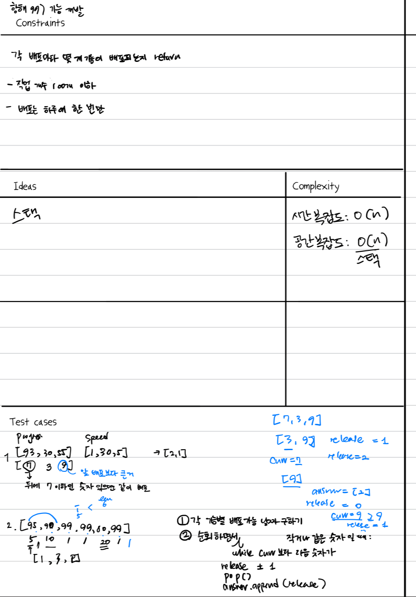

# 문제 기능개발

-  https://school.programmers.co.kr/learn/courses/30/lessons/42586?language=python3

## 아이디어
- 각 기능별 배포 가능 날짜 (스택) 구하기
- 배포 가능 날짜를 순회하면서 curr보다 다음 배포날이 작거나 같으면 release += 1하고 배포 가능 날짜 스택에서 pop
- 아닌 경우 answer에 append하고 release, curr를 초기화



## 풀이
```python
import math
from collections import deque
def solution(progresses, speeds):
    days_before_release = deque([])
    for p, s in zip(progresses, speeds):
        days = math.ceil( (100 - p) / s)
        days_before_release.append(days)

    curr = days_before_release[0]
    release = 0
    answer = []
    i = 0
    
    while i < len(progresses):
        while days_before_release and (curr >= days_before_release[0]):
            release += 1
            days_before_release.popleft()
            i += 1
            
        answer.append(release)
        release = 0
        if days_before_release:
            curr = days_before_release[0]
    
    return answer

if __name__ == "__main__":
    progresses, speeds = [93,30,55], [1,30,5]
    print(solution(progresses, speeds)) # [2,1]
    progresses, speeds = [95, 90, 99, 99, 80, 99], [1, 1, 1, 1, 1, 1]
    print(solution(progresses, speeds)) # [1,3,2]
    progresses, speeds = [95, 90, 99, 99, 80, 99, 99], [1, 1, 1, 1, 1, 1,1]
    print(solution(progresses, speeds)) # [1,3,3]
```

## 배운 점
- while문 조건과 루프 돌 때 인덱스를 늘 명확하게 미리 생각을 하고 쓰자.
- 대략적인 아이디어만 가지고 코드를 짜기 시작하니 인덱스 에러가 난 다음에 고치게 되는 것 같다.
- 이번에는 `curr = days_before_release[0]`에서 인덱스 에러가 났었다...
