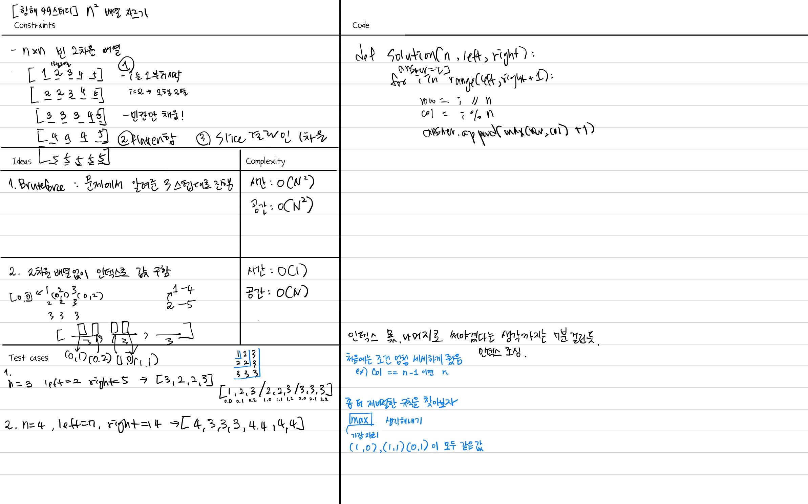

## 문제
정수 n, left, right가 주어집니다. 다음 과정을 거쳐서 1차원 배열을 만들고자 합니다.
n행 n열 크기의 비어있는 2차원 배열을 만듭니다.
i = 1, 2, 3, ..., n에 대해서, 다음 과정을 반복합니다.
1행 1열부터 i행 i열까지의 영역 내의 모든 빈 칸을 숫자 i로 채웁니다.
1행, 2행, ..., n행을 잘라내어 모두 이어붙인 새로운 1차원 배열을 만듭니다.
새로운 1차원 배열을 arr이라 할 때, arr[left], arr[left+1], ..., arr[right]만 남기고 나머지는 지웁니다.
정수 n, left, right가 매개변수로 주어집니다. 주어진 과정대로 만들어진 1차원 배열을 return 하도록 solution 함수를 완성해주세요.

https://school.programmers.co.kr/learn/courses/30/lessons/87390


## 주의할 점
- max 값을 사용하는 규칙을 찾기 전까지는 인덱스에 따라 조건을 엄청 세세하게 줬었는데 보니까 
좀 더 제너럴한 규칙을 찾는 것을 목표로 하자.


## 풀이


## 코드
```python
def solution(n, left, right):
    answer = []
    
    for i in range(left, right+1):
        row = i // n
        col = i % n
        curr = max(row, col) + 1

        answer.append(curr)
    return answer

```

