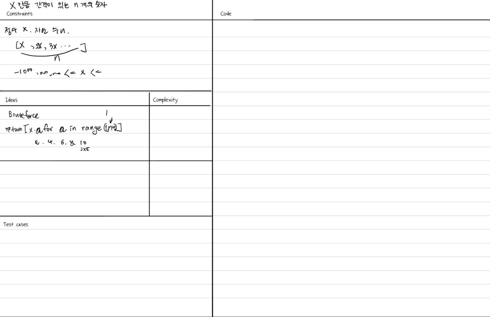
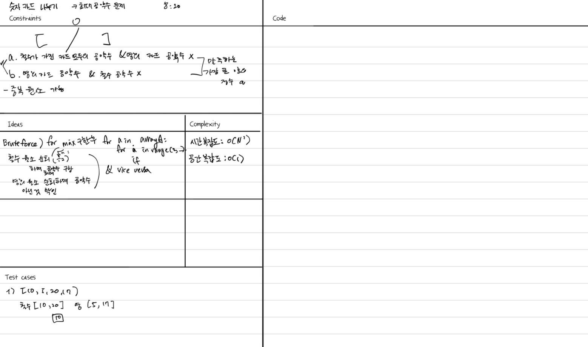

## 문제 1 x만큼 간격이 있는 n개의 숫자
https://school.programmers.co.kr/learn/courses/30/lessons/12954

### 아이디어
리스트 구현


### 풀이
```python
def solution(x, n):
    answer = [x * a for a in range(1, n+1)]
    return answer
```

### 배운 점
간단한 구현 문제였고, 역시 간단한 루프는 리스트 컴프리헨션으로 짜는 것이 깔끔하고 보기에 좋다.


## 문제 2 숫자 카드 나누기
https://school.programmers.co.kr/learn/courses/30/lessons/135807

### 내 풀이 -> 일부 통과 24/36
최대 공약수가 될 수 있는 2부터 배열 최솟값까지 루프를 도는 식으로 풀어봤지만, 시간 복잡도가 O(NM)이기 때문에 시간 초과가 많이 나서 통과되지 못했다. (M: 2~최솟값)


```python
def solution(arrayA, arrayB):
    answer = 0
    
    # Case 1:
    min_a = min(arrayA)
    
    for i in range(2, min_a + 1):
        all_divisible = True
        for num in arrayA:
            if num % i != 0:
                all_divisible = False
                break
        if all_divisible and all(num % i != 0 for num in arrayB):
            answer = max(answer, i)
    
    if answer != 0:
        return answer
    
    # Case 2:
    min_b = min(arrayB)
    
    for i in range(2, min_b + 1):
        all_divisible = True
        for num in arrayB:
            if num % i != 0:
                all_divisible = False
                break
        if all_divisible and all(num % i != 0 for num in arrayA):
            answer = max(answer, i)
    
    return answer


```

## 통과된 풀이
유클리드 알고리즘으로 gcd를 구하며, 리스트의 GCD를 계산할 때 모든 요소를 한 번씩만 처리하므로 빠른 것 같다.
$O(n * \log(\text{min_elementA}) + m * \log(\text{min_elementB}) + n + m)$

```python
def gcd(a, b):
    while b:
        a, b = b, a % b
    return a

def gcd_of_list(lst):
    def custom_reduce(function, iterable):
        it = iter(iterable)
        value = next(it)
        for element in it:
            value = function(value, element)
        return value

    return custom_reduce(gcd, lst)

def solution(arrayA, arrayB):
    def valid_divisor(divisor, array):
        return all(num % divisor != 0 for num in array)

    gcd_a = gcd_of_list(arrayA)
    gcd_b = gcd_of_list(arrayB)

    answer = 0

    if valid_divisor(gcd_a, arrayB):
        answer = gcd_a

    if valid_divisor(gcd_b, arrayA):
        answer = max(answer, gcd_b)

    return answer

if __name__ == "__main__":
    case1_a, case1_b = [14, 35, 119], [18, 30, 102]
    print(solution(case1_a, case1_b))

```

## 배운 점
