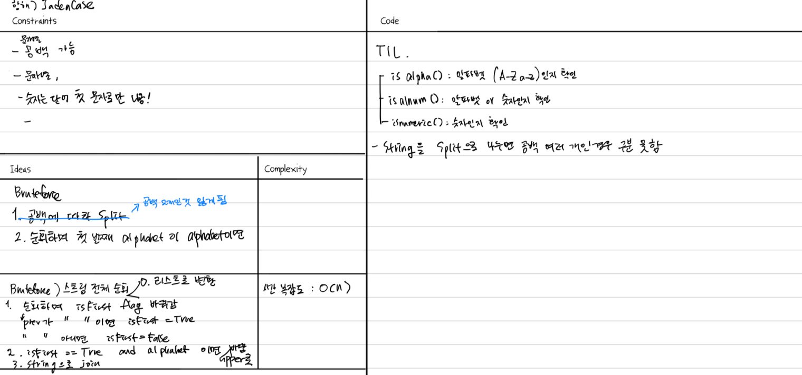

## 문제 JadenCase
https://school.programmers.co.kr/learn/courses/30/lessons/12951


## 아이디어
스트링 전체 순회하기
1. 스트링을 리스트로 변환(공백이 보존됨)
2. 순회하면서 isFirst flag로 첫 번째 문자인지 확인
- prev_char가 " "이고 현재 char가 alphanumeric이면 isFirst
3. isFirst면서 alphabet이면 upper()로 대문자 변환,
아니면 lower()로 소문자 변환
4. 변환된 리스트를 다시 스트링으로 join



## 풀이
```python
def solution(s):
    if not s:
        return s
    
    prev_char = " "
    isFirst = True
    s_array = [a for a in s]
    
    for i, char in enumerate(s_array):
        if prev_char == " " and char.isalnum():
            isFirst = True
        else:
            isFirst = False
        if char.isalpha():
            if isFirst is True:
                s_array[i] = char.upper()
            else:
                s_array[i] = char.lower()
        prev_char = char
    
    answer = "".join(s_array)
        
    return answer
```

## 배운 점
- string을 split()으로 나누면 공백 여러 개인 경우 구분 못함
- isalpha(): 알파벳인지(A-Za-z) 확인
- isdigit(): 숫자인지 확인. 
- isnumeric(): 숫자인지 확인. Superscript(위 첨자), subscript, 분수, 로마자 등 더 넓은 범위의 숫자 포함. ex) Ⅳ,½, ²
- isalnum(): 알파벳인지 숫자인지 확인
- isspace(): 공백인지 확인

