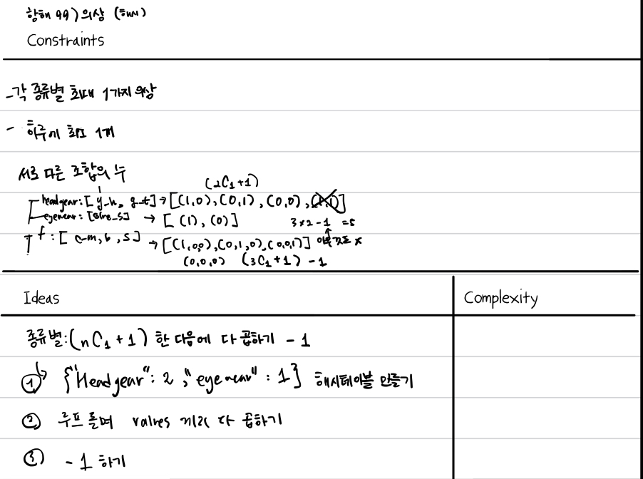

# 문제 1 의상
https://school.programmers.co.kr/learn/courses/30/lessons/42578

## 아이디어
- 옷의 종류별로 최소 0개에서 최대 1개까지 입을 수 있기 때문에 $nC_1$ + 1
- 예를 들면 a옷과 b옷이 같은 종류이면 선택지는 {a, b, 0} 이렇게 된다.
- 그래서 종류별로 선택지의 개수를 곱한 다음에 아무것도 안 입는 선택지 1개를 빼면 답이 된다.

## 풀이


1. 종류별 옷의 개수를 해시 테이블로 만들기
2. 루프 돌면 values끼리 다 곱하기
3. -1 하기

```python
from collections import defaultdict

def solution(clothes):
    clothes_dict = defaultdict(int)
    for (name, type) in clothes:
        clothes_dict[type] += 1
    
    answer = 1
    for v in clothes_dict.values():
        answer *= (v+1)
    
    return answer - 1
```
## 배운 점
- "종류별" 개수를 이용할 때는 해시 테이블을 만드는 경우가 많은 것 같다.

# 문제 2 테이블 해시 함수
https://school.programmers.co.kr/learn/courses/30/lessons/147354

## 아이디어
- 주로 문제에서 제시한 단계별 구현 위주로 했다.
- 정렬할 때 조건이 두 개이기 때문에 이때 3개 튜플을 이용해서 원래 인덱스, 조건 1, 조건 2를 저장해서 사용했다.
- 첫 번째 조건은 오름차순 정렬이고, 두 번째 정렬은 내림차순 정렬이기 때문에 `sorted(data, key= lambda x: (x[a], -x[b]))` 이런 식으로 -를 붙였다. 

## 풀이
1. 정렬하기
2. 정렬된 데이터의 인덱스 이용해서 원래 data의 인덱스를 구한 다음에 row별 s_i 구하기
3. s_i들끼리 XOR해서 답 구하기

```python
def solution(data, col, row_begin, row_end):
    # 1. Sort
    index_col_tuple = [(i, row[col-1], row[0]) for i, row in enumerate(data)]
    sorted_data = sorted(index_col_tuple, key=lambda x: (x[1], -x[2]))
    
    # 2. S_i
    answer = 0
    for i in range(row_begin-1, row_end):
        original_index = sorted_data[i][0]
        s_i = sum([a % (i+1) for a in data[original_index]])
        answer ^= s_i
            
    return answer

```
## 배운 점
- 첫 번째 조건은 오름차순 정렬이고, 두 번째 정렬은 내림차순 정렬이기 때문에 `sorted(data, key= lambda x: (x[a], -x[b]))` 이런 식으로 -를 붙였다.
- 0은 어떤 숫자와 XOR하든 그 숫자가 그대로 나오기 때문에 XOR할 때 초기값을 0으로 두면 된다.